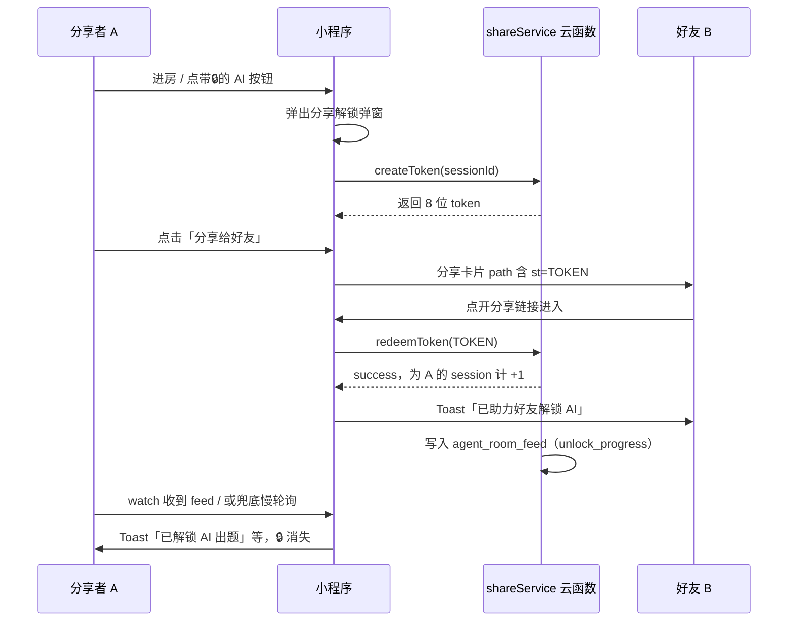

# 分享解锁 AI 功能 — 流程说明

本文描述「家庭聚会助手」小程序当前**分享确认解锁 AI** 的完整流程（产品视角 + 技术视角）。

云环境：`cloud1-d9g01no7m292bc511-d5e875d`（见 `cloud-env.js`）

---

## 一、产品规则（用户能感知到的）

### 1. 解锁梯度（本场有效）

| 好友确认次数 | 解锁等级 | 可用功能 |
|-------------|---------|----------|
| 0 | 未解锁 | AI 按钮带 🔒，点击弹出分享弹窗 |
| 1 | Lv1 | AI 出题（如卧底词对、你画我猜题目、猜歌主持词等） |
| 2 | Lv2 | AI 策略建议 |
| 3 | Lv3 | AI 战报 / 聚会建议 / 生成海报等 |

**重要**：计次条件是「好友点开你发出的分享链接」，不是「你打开了分享菜单」。只转发但未点开链接，不算数。

### 2. 场次与重置

| 场景 | sessionId 规则 | 解锁进度 |
|------|----------------|----------|
| 在玩法房间里（创建/加入成功） | 每次进房生成新的 `sess_xxx` | 本场从 0 开始累计 |
| 离开房间页（返回首页等） | 清除房间场次 | **本地进度清零**，下一场需重新分享 |
| 仅在首页（未进房） | `day_YYYY-MM-DD` | 按自然日，跨日自动视为新一天 |

### 3. 界面交互

- **首页**：不常驻展示分享条；仅保留「AI 聚会建议」等入口，未解锁时显示 🔒。
- **各玩法页**：未解锁的 AI 按钮带 🔒；点击后弹出 **`ai-share-modal` 弹窗**（提示文案 + 绿色「分享给好友」+「分享到朋友圈」）。
- **弹窗文案**：A/B/C 三版随机分桶，同一设备保持稳定（`utils/shareUnlockCopy.js`）。

---

## 二、用户操作流程（分享者 A + 好友 B）



### 步骤说明

**分享者 A**

1. 进入同场玩法并创建/加入房间（自动开启本场 `sessionId`）。
2. 点击任意带 🔒 的 AI 功能，或首页「AI 聚会建议」。
3. 在弹窗中点击「分享给好友」（或按引导分享到朋友圈）。
4. 等待好友 B 点开链接；好友兑换后**实时** push 到 `agent_room_feed`，本机 watch 收到即解锁（watch 失败时约 60 秒兜底轮询一次）。
5. 再次点击原 AI 按钮，即可正常使用。

**好友 B**

1. 在微信中点开 A 发来的小程序分享卡片。
2. 自动进入对应页面（首页或房间页），链接参数带 `st=分享码`。
3. 首次有效打开时自动兑换，并提示「已助力好友解锁 AI」。
4. 同一分享码仅第一次有效；不能点自己的链接。

---

## 三、技术流程

### 1. 模块分工

| 模块 | 路径 | 职责 |
|------|------|------|
| 云函数 | `cloudfunctions/shareService/` | 创建 token、兑换、查询进度 |
| 前端 API | `utils/shareService.js` | `wx.cloud.callFunction` 封装 |
| 解锁状态 | `utils/aiUnlock.js` | 本地缓存 + 云端同步 + 弹窗 |
| 实时推送 | `utils/shareUnlockFeed.js` | watch `agent_room_feed`，替代高频轮询 |
| 场次 | `utils/partyAiSession.js` | `sessionId` 生成与离房清理 |
| 分享卡片 | `utils/shareHelper.js` | `onShareAppMessage` / 链接拼 `st` |
| 分享图 | `utils/shareInviteCard.js` | 离屏 canvas 预生成口令图 |
| 进房钩子 | `utils/partyAiRoomHooks.js` | 进房预热 token / 分享图；离房重置 |
| 弹窗 UI | `components/ai-share-modal/` | 分享引导弹窗 |
| 门禁 | `utils/aiHelper.js`、`utils/agentHelper.js` | 调用 AI 前 `ensureAiUnlock` |

### 2. 分享码（token）生命周期

```
进房 / 打开分享弹窗 / 页面 onShow
    → prepareShareToken()
    → shareService.createToken(sessionId)
    → 云端写入 share_tokens，返回 8 位码（如 AB3D9F2K）
    → 缓存在 page._shareTokenCache

用户点击「分享给好友」
    → onShareAppMessage → getShareTokenForShare()
    → 分享 path/query 带上 st=TOKEN
    → 同时预生成下一个 token 供下次分享

好友打开链接
    → 页面 onLoad → tryRedeemShareFromQuery(query)
    → shareService.redeemToken(TOKEN)
    → 云端标记 redeemed，分享者 shareCount +1
    → 写入 agent_room_feed（roomId=unlock_{sessionId}, type=unlock_progress）

分享者页面
    → onShow：getUnlockProgress 拉一次 + watch feed
    → feed 变更 → 合并本地 ai_share_unlock_v2 → Toast
    → watch 失败时：每 60 秒兜底轮询一次
```

### 3. 实时推送与兜底轮询

- **主路径**：`shareUnlockFeed.js` 监听 `agent_room_feed`（`roomId = unlock_{sessionId}`，`type = unlock_progress`）。
- **兜底**：watch 启动失败时，每 **60 秒** 调用一次 `getProgress`（不再 5～30 秒高频轮询）。
- 满级或离房：关闭 watch 与兜底定时器。

### 4. 云侧优化（shareService）

| 能力 | 说明 |
|------|------|
| token 防刷 | 同一用户同一场次最多 **10** 个未使用 token |
| 进度推送 | 兑换成功后写 `agent_room_feed` |
| 分析埋点 | 可选集合 `analytics_share_unlock`（token_created / token_redeemed / progress_checked） |
| 预热 | `action: 'warm'` 或定时触发器 `warmer`（可选，减冷启动） |

### 5. 云函数 API（`shareService`）

| action | 调用方 | 说明 |
|--------|--------|------|
| `createToken` | 分享前预热 | 入参 `sessionId`，返回 `{ token }` |
| `redeemToken` | 好友 `onLoad` | 入参 `token`，成功则分享者本场 +1 |
| `getProgress` | 分享者轮询 | 入参 `sessionId`，返回 `unlockLevel` / `shareCount` |
| `checkUnlock` | 可选自检 | 入参 `sessionId`, `requiredLevel` |
| `checkToken` | 可选 | 查询 token 是否有效/已用/过期 |
| `updateProgress` | 一般不用 | 手动改进度（调试） |

前端封装见 `utils/shareService.js`。

### 6. 数据库集合

| 集合 | 主要字段 |
|------|----------|
| `share_tokens` | `token`, `sharerOpenId`, `sessionId`, `redeemed`, `expiresAt` |
| `share_unlock_users` | `openId`, `sessionId`, `shareCount` / `unlockLevel`, `expiresAt` |
| `agent_room_feed` | `roomId`, `type`, `toOpenId`, `payload`, `createdAt`（与副主持共用，需客户端可读） |
| `analytics_share_unlock` | 可选，转化漏斗埋点 |

`share_*` 仅云函数写；`agent_room_feed` 需对登录用户 **read: true**（见 `docs/Agent聚会助手.md`）。

### 6. AI 功能门禁示例

```text
用户点击「AI 生成词对」
  → runAi() / runPlayerAssist() / runPartyRecommend()
  → ensureAiUnlock(LEVEL.GEN, 'AI 出题', page)
      ├─ 已解锁 → 继续调 AI
      └─ 未解锁 → openAiShareModal(page)，return
```

等级常量（`utils/aiUnlock.js`）：

- `LEVEL.GEN = 1` — 出题类  
- `LEVEL.ASSIST = 2` — 策略建议  
- `LEVEL.RECAP = 3` — 战报 / 聚会建议 / 海报  

---

## 四、涉及页面

以下页面已接入：`tryRedeemShareFromQuery`、`onPageShowUnlock`、离房 `onRoomLeft`、`ai-share-modal`。

| 页面 | 分享 kind | 典型 AI 入口 |
|------|-----------|--------------|
| 首页 `index` | `index` | AI 聚会建议 |
| 谁是卧底 `undercover` | `undercover` | AI 词对、策略、战报 |
| 你画我猜 `draw-guess` | `draw` | AI 出题 |
| 身份推理 `werewolf` | `werewolf` | 战报、海报 |
| 趣味抽签 `drink-party` | `drink` | 解说、策略、战报 |
| 疯狂猜歌 `song-guess` | `music` | 主持词 |
| 真心话等 `play` | `truthDare` / `index` | 房间内 AI |

---

## 五、部署与上线

步骤见 **[shareUnlock-部署与测试.md](./shareUnlock-部署与测试.md)**。上线前确认：云环境、集合与索引、`shareService` 已部署、`cloud-env.js` 中 `debugCloudLog: false`。

---

## 六、相关文档

- [AI聚会助手.md](./AI聚会助手.md) — AI 能力与云环境  
- [shareUnlock-部署与测试.md](./shareUnlock-部署与测试.md) — 部署清单  
- [游戏玩法与逻辑说明.md](./游戏玩法与逻辑说明.md) — 各玩法 AI 入口说明  
