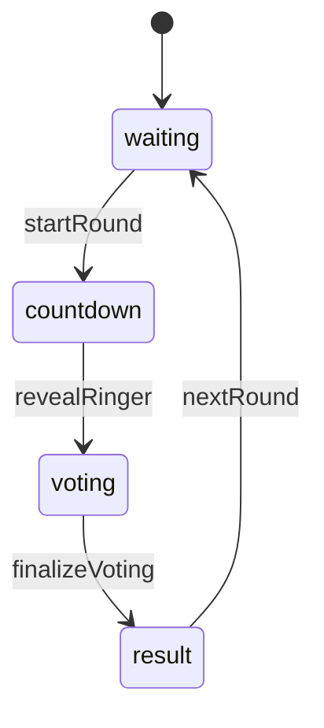
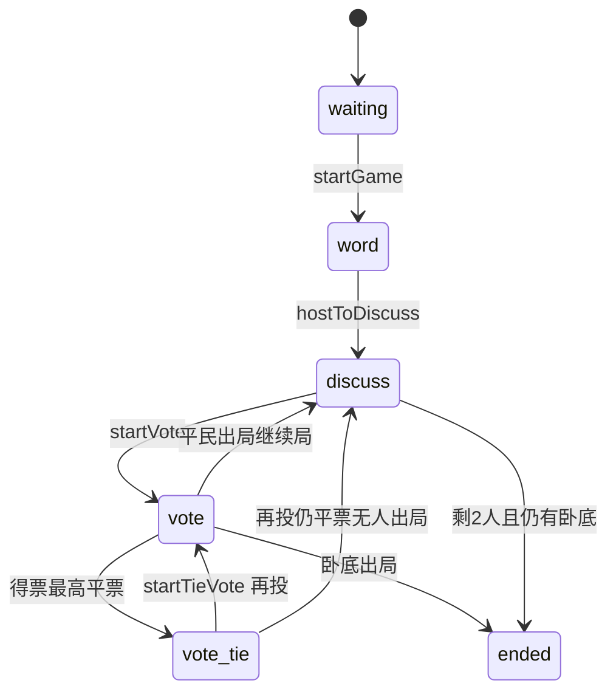
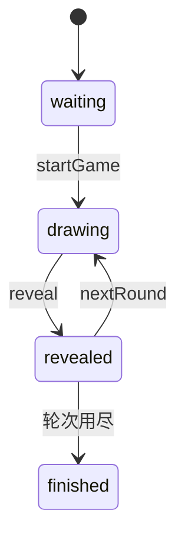

# 家庭聚会助手 — 游戏玩法与逻辑说明

> 本文档根据当前代码整理，供 DeepSeek 等 AI 理解产品行为、状态机与云函数接口。  
> 项目路径：`projects/wechat-mini/2026-04-26-family-party-games`  
> 云环境 ID：`cloud1-d9g01no7m292bc511`（见 `cloud-env.js`）  
> 本地校验闭环：见 **§14**（`node scripts/test-room-ui.js`）

---

## 1. 产品定位

- **名称**：家庭聚会助手（微信小程序）
- **形态**：亲友凭口令进同一「聚会组」，各自用手机；**不做陌生匹配、不做广域联机匹配**
- **两类实现**：
  1. **云同场同步**（6 位数字口令）：状态写在云数据库，多端轮询/读库同步
  2. **单机/主持人辅助**（多数走 `pages/play/play`）：随机题、计时、本地计分；可选 4 位口令房（`roomService`）仅用于真心话大冒险同场投票

---

## 2. 页面与路由

| 页面 | 路径 | 用途 |
|------|------|------|
| 首页 | `pages/index/index` | 游戏列表、输入口令进组、开始互动 |
| 建房/设置 | `pages/setup/setup` | 云游戏创建聚会组；本地游戏生成 4 位口令 |
| 身份推理 | `pages/werewolf/werewolf` | 狼人杀聚会版（云） |
| 谁是卧底 | `pages/undercover/undercover` | 卧底 v2（云） |
| 你画我猜 | `pages/draw-guess/draw-guess` | 同屏画布猜词（云） |
| 疯狂猜歌 | `pages/song-guess/song-guess` | 主持本机外放、他人抢答（云） |
| 趣味抽签 | `pages/drink-party/drink-party` | 倒计时+响铃+投票（云） |
| 通用玩法 | `pages/play/play` | 本地辅助 + 真心话大冒险 4 位同场 |

### 2.1 术语表

| 术语 | 含义 |
|------|------|
| **聚会组** | 用户可见概念：亲友凭口令进入的同一局，界面文案多用「聚会组」「互动组」 |
| **房间（room）** | 代码与云数据库中的文档（如 `drink_rooms` 一条记录），对用户一般不直说「房间」 |
| **房号（roomCode）** | 数字口令：6 位用于云同场玩法，4 位用于 `roomService` 老聚会组 |
| **组长 / 房主 / 主持** | 创建聚会组的 `hostOpenId`；各玩法「开始」类按钮多仅此人可点 |
| **phase** | 局内阶段（如 `waiting`、`voting`），写在 `*_gameState` 或 room 文档上 |

---

## 3. 口令与进组逻辑

### 3.1 两套口令体系

| 类型 | 位数 | 云函数/集合 | 用途 |
|------|------|-------------|------|
| **老聚会组** | 4 位 | `roomService` → `rooms` | 创建时绑定 `selectedGame`，进组后跳转对应玩法；真心话大冒险同场投票 |
| **同场聚会组** | 6 位 | 各独立 `*RoomService` | 卧底、身份推理、画猜、猜歌、趣味抽签；**彼此数据隔离** |

说明：**6 位是房号（roomCode），不是最少人数。**

> **开发注意（勿混用两套口令）**  
> 新增**云同场**玩法必须使用 **6 位** + 独立 `*RoomService`（如 `fooRoomService`），并接入 `utils/roomUi.js` 的 `runStartAction` 与 `utils/shareHelper.js`。  
> **不要**把新玩法挂在旧 **4 位** `roomService` / `rooms` 上，否则无法复用统一开始前校验、分享 query、以及首页 6 位进组探测链。

### 3.2 首页「输入口令」流程（`index.js`）

```
输入数字
  ├─ 长度 6 → 依次尝试进组（失败则试下一个）：
  │     1. undercoverRoomService.join  → 成功进 pages/undercover
  │     2. werewolfService.join        → 成功进 pages/werewolf
  │     3. musicRoomService.join       → 成功进 pages/song-guess
  │     4. drawRoomService.join        → 成功进 pages/draw-guess
  │     5. drinkRoomService.join       → 成功进 pages/drink-party
  │     全部失败 → Toast「该数字口令非本程序已开的同场聚会组」
  └─ 长度 4 → roomService.join → 按房间内 selectedGame 跳转（含真心话大冒险）
```

### 3.3 首页「开始互动」路由（`index.js` `startGame`）

| screen | 行为 |
|--------|------|
| `werewolf` / `songGuess` / `drawGuess` / `drinkParty` | → `setup` 页创建 6 位云聚会组 |
| `undercover` | → `setup`（实际创建走 v2 云函数） |
| 其他 | → `setup` 或 `play`（`roomService.create` 4 位口令） |

同场类游戏在首页排序优先（`SORT_TIER`），并可按 `gameStatsService` 点击量排序。

### 3.4 开始前校验（通用，`runStartAction`）

所有云同场玩法在调用云的「开始」类 action 之前，**不会直接开局**；由 `utils/roomUi.js` 的 `runStartAction` 统一收口：

```
用户点「开始 / 发牌 / 开始本轮」
  → ① 本地 localChecks（各页自行组装）
  → ② wx.cloud.callFunction（silent: true）
  → ③ result.errMsg ? 弹窗 explain*StartFail : onSuccess 刷新视图
```

**① 本地校验（`buildStartChecks` → `localChecks`）**

各云同场页统一调用 `utils/roomUi.js` 的 **`buildStartChecks(opts)`** 生成校验项，再传入 `runStartAction`：

```javascript
const checks = buildStartChecks({
  isHost: v.isHost,
  playerCount: n,
  minPlayers: 2,        // 可选：2 或 3
  needPlayers: need,    // 可选：卧底/身份推理满员
  kind: 'draw',         // drink|undercover|werewolf|draw|music|truthDare
  ctx: { playerCount: n, needPlayers: need },
  hostLabel: '组长',    // 真心话用「主持人」
  startVerb: '点击「开始」',
  extra: []             // 趣味抽签可追加阶段校验
})
```

| 校验项 | 典型处理 | 使用页面 |
|--------|----------|----------|
| 是否组长/主持 | 弹窗「无权限」 | 全部云同场（经 `buildStartChecks`） |
| 人数 ≥ 最小人数 | `explain*StartFail` 友好文案 | drink ≥2；undercover ≥3；draw/music ≥2；truthDare ≥2 |
| 人数 = 设定人数 | undercover / werewolf `人未满` | undercover、werewolf |
| 房间阶段 | drink：`extra` 追加 result/countdown/voting 校验 | drink |

**② 云侧校验（云函数 throw / `return { errMsg }`）**

常见：`至少 N 人`、`仅房主/组长`、`已开局`、`人未满`、`词库/曲库不足`、`请先结束本回合` 等。  
前端用 `kind`（`drink` / `undercover` / `werewolf` / `draw` / `music` / `truthDare`）映射到 `explainStartFail` 生成标题与说明。

**③ 成功后**

执行 `onSuccess`（通常 `loadView()` / 刷新 state），**此时才算真正进入对局阶段**。

相关单测：`node scripts/test-room-ui.js`（校验文案与分享 query，见 §14）。

---

## 4. 云同场游戏（核心逻辑）

### 4.0 最少人数与开始 action（速查）

| 玩法 | 云函数 | 开始 action | 最少/满员规则 | `runStartAction` kind |
|------|--------|-------------|---------------|------------------------|
| 趣味抽签 | `drinkRoomService` | `startRound` | ≥ **2** 人 | `drink` |
| 谁是卧底 v2 | `undercoverRoomService` | `startGame` | ≥ **3** 人，且 **人数 = maxPlayers**（4–12） | `undercover` |
| 你画我猜 | `drawRoomService` | `startGame` | ≥ **2** 人 | `draw` |
| 疯狂猜歌 | `musicRoomService` | `startGame` | ≥ **2** 人（云端 `startGame` 已校验） | `music` |
| 身份推理 | `werewolfService` | `start` | **满员**：进组人数 = 板子 **6/8/10/12** | `werewolf` |
| 真心话大冒险·同场 | `roomService` | `tdStart` | ≥ **2** 人；须 **4 位** 房 | `truthDare` |

通用约定：

- **组长/房主**：创建者 `hostOpenId`，多数「开始」类操作仅组长可执行（云函数内 `assertHost` 二次校验）
- **客户端**：定时 `getView` 或读 `*_gameState` / watch 集合文档刷新 UI
- **开始前**：必须先过 §3.4 `runStartAction`，勿在云函数里假设前端已拦掉所有非法开始

---

### 4.1 趣味抽签（`drinkParty`）

**页面**：`pages/drink-party/drink-party.js`  
**云函数**：`drinkRoomService`  
**集合**：`drink_rooms`、`drink_players`、`drink_gameState`（公态快照）、`drink_votes`（每轮投票记录）

**最少人数**：开始本轮 ≥ **2 人**（组长操作）

**阶段 `phase`**：

| phase | 含义 |
|-------|------|
| `waiting` | 等待组长「开始本轮」 |
| `countdown` | 倒计时（默认 **3 秒**，`COUNTDOWN_MS=3000`） |
| `voting` | 已揭晓「响铃者」，全员投票指认（默认 **30 秒** `VOTE_MS=30000`） |
| `result` | 投票结算展示 |

**一轮流程**：

1. 组长 `startRound` → `countdown`，记录 `countdownEndsAt`
2. 倒计时结束后，**任意在组内的人**可 `revealRinger` → 随机一名玩家为 `targetOpenId`（响铃者），进入 `voting`
3. 玩家 `submitVote(toOpenId)` 或 `submitAbstain`；组长可 `finalizeVoting`（或全员投完/超时）
4. `computeResultFromVotes`：统计投中响铃者的人、投错的人（`wrongVoters` 带 nickName）
5. 组长 `nextRound` → 回到 `waiting`

**云 actions**：`create`、`join`、`setRoomName`、`startRound`、`revealRinger`、`submitVote`、`submitAbstain`、`finalizeVoting`、`nextRound`、`getOpenId`

**AI**（可选）：结果页 `runAi` 生成解说 / 趣味任务文案（`aiHelper`）

---

### 4.2 谁是卧底 v2（`undercover`）

**页面**：`pages/undercover/undercover.js`  
**云函数**：`undercoverRoomService`  
**集合**：`uc_rooms`、`uc_players`、`uc_state`（公屏快照）  
**与旧版隔离**：不用 4 位 `rooms`；旧版 `roomService.undercoverAssign` 仍存在但首页主推 v2

**最少人数**：发牌 ≥ **3 人**；且 `players.length === maxPlayers`（默认 max 4–12，组长 `setConfig` 设定）

**房间 `status`**：`waiting` → `playing` → `finished`

**局内 `currentPhase`**：

| phase | 含义 |
|-------|------|
| `waiting` | 建房等人 |
| `word` | 已发词，玩家本机看词并 `ackWord` |
| `discuss` | 按 `speakOrder` 轮流发言（组长 `hostNextSpeak`） |
| `vote` | 放逐投票 |
| `vote_tie` | 平票，仅可投平票玩家 |
| `ended` | 本局结束 |

**发牌规则**（`startGame`）：

- 词对来自内置 `PAIRS` 或组长预设 `setCustomPair` / AI 生成后 `pendingPair`
- **仅 1 名卧底**，其余平民；词写入各玩家 `uc_players.word`（客户端私显）
- 随机发言顺序 `speakOrder`

**投票与胜负**（`endVote`）：

- 得票最高者出局；平票 → `vote_tie` 再投；再平票 → 回到 `discuss` 无人出局
- 出局者是卧底 → 平民胜 `gameResult: civilian`
- 剩 2 人且仍有卧底 → 卧底胜 `gameResult: undercover`
- 否则进入下一轮讨论（`currentRound++`）

**云 actions**：`create`、`join`、`setConfig`（maxPlayers）、`setCustomPair`、`startGame`、`ackWord`、`hostToDiscuss`、`hostNextSpeak`、`startVote`、`startTieVote`、`submitVote`、`endVote`、`getView`

**AI**：`setCustomPair` 可 AI 生成 JSON 词对；局末 AI 战报

---

### 4.3 秘密身份推理 / 狼人杀聚会版（`werewolf`）

**页面**：`pages/werewolf/werewolf.js`  
**云函数**：`werewolfService`  
**集合**：`werewolf_rooms`、`werewolf_state`

**板子人数**：**6 / 8 / 10 / 12**（`DECK` 固定身份分配）

| 人数 | 身份构成（代码） |
|------|------------------|
| 6 | 狼×2、预、巫、民×2 |
| 8 | 狼×2、预、巫、猎、民×3 |
| 10 | 狼×3、预、巫、猎、民×4 |
| 12 | 狼×4、预、巫、猎、民×5 |

**流程**：组长 `setSize` → 等人满 → `start` → 夜晚/白天由**组长（主持）**推进（非全自动法官）

**`game.phase` 主要值**：

`lobby` → `night` → `day_announce` → `speak` → `vote` → （可能 `hunter`）→ 再 `night` … → `end`

**夜间**（存活玩家）：

- 狼人 `wWolf` / 组长代操作 `hostWolfSet`
- 预言家 `wSeer`
- 女巫 `wWitch`（解药/毒药逻辑在云函数内）
- 组长 `hostResolveNight` 结算死亡 → `day_announce`

**白天**：`hostDawnToSpeak` → `hostNextSpeak` → `hostStartVote` → 玩家 `vote` → `hostResolveVote`；猎人出局可 `hunterShot`

**权限**：狼人/神职仅自己可见操作；全员通过 `getView` 看公屏阶段与存活列表；**身份仅本机展示**

**云 actions**：`create`、`join`、`setSize`、`start`、`wWolf`、`wSeer`、`wWitch`、`hostWolfSet`、`hostResolveNight`、`hostDawnToSpeak`、`hostNextSpeak`、`hostStartVote`、`vote`、`hostResolveVote`、`hunterShot`、`getView`

**AI**：局末 AI 战报

---

### 4.4 你画我猜（同场画布）（`drawGuess`）

**页面**：`pages/draw-guess/draw-guess.js`  
**云函数**：`drawRoomService`  
**集合**：`draw_rooms`、`draw_players`、`draw_gameState`、画布数据（`clearCanvasDoc` / `updateCanvas`）

**最少人数**：≥ **2 人**

**组长配置**：总轮数 `totalRounds`、每轮时长 `roundDuration`、词库分类 `wordCategory`；可选 `setPendingWord`（含 AI 出题）

**阶段**：

| phase | 含义 |
|-------|------|
| `waiting` | 等人、配置 |
| `drawing` | 当前 `currentDrawerOpenId` 绘画，其他人 `submitGuess` 抢答 |
| `revealed` | 揭晓词语与本轮猜中情况 |
| `finished` | 全部轮次结束或组长 `endGame` |

**流程**：

1. `startGame` → 选词（pending 或词库 `pickNewWord`）→ 指定本轮画家 → `drawing`
2. 画家 `updateCanvas` 同步笔画；他人提交答案，命中记入 `roundHits`
3. 倒计时结束或组长提前 `reveal` → `revealed`
4. 组长 `nextRound` → 下一位画家；轮数用尽 → `finished`

**云 actions**：`create`、`join`、`setConfig`、`setPendingWord`、`startGame`、`reveal`、`nextRound`、`skipWord`、`submitGuess`、`updateCanvas`、`endGame`、`getView`

---

### 4.5 疯狂猜歌（同场）（`songGuess`）

**页面**：`pages/song-guess/song-guess.js`  
**云函数**：`musicRoomService`（曲库 `cloudfunctions/musicRoomService/songs.js`）  
**集合**：`music_rooms`、`music_players`、`music_gameState`

**最少人数**：≥ **2 人**（建议 1 人主持 + 其他人猜）

**机制**：

- **未购曲库**：小程序内不统一播歌；每轮随机一名 **主持**（`roundHostOpenId`），在其手机上看歌名并**本机外放**，其他人只听、输入歌名抢答
- 开局 `startGame`：从曲库 shuffle 取 `totalRounds` 首（5/10/15），`phase: round_playing`
- `submitAnswer`：主持不能猜；匹配 `title` 或 `aliases`（归一化后比较）；每轮限时 `roundDuration`（默认 30s）
- 组长 `nextSong` → 下一首或 `finished`

**云 actions**：`create`、`join`、`setRounds`、`startGame`、`nextSong`、`submitAnswer`、`getView`

**AI**：主持词/气氛文案

---

### 4.6 真心话大冒险 · 同场（4 位口令）

**页面**：`pages/play/play.js`，`mode: truthDareRoom`，需 `config.roomCode` 为 4 位  
**云函数**：`roomService`（`rooms` 集合，TTL 约 4 小时）

**最少人数**：≥ **2 人**

**流程**：

1. 主持 `tdStart`：随机 `targetOpenId` 为「被选中人」，`phase: voting`
2. 其他人 `tdVote`：`truth` 或 `dare`（被选中者不能投）
3. 主持 `tdTally`：计票；**平票**触发隐藏彩蛋文案 `TRUTH_DARE_CURSE`（仅平票下发，产品上不宣传）
4. 胜方决定类型后，被选中者在本地 `play` 页用 `truthQuestions` / `dareQuestions` 抽题展示
5. 主持再 `tdStart` 进入下一轮

**云 actions**：`tdStart`、`tdVote`、`tdTally`、`tdGetState`（轮询 2s）

**单机真心话**（无 4 位房）：同页 `mode: truthDare`，仅本地随机题库。

---

## 5. 本地 / 规则辅助游戏（`pages/play/play`）

数据定义：`data/game-data.js` → `helperGames` + 各题库常量。

进入方式：首页点「开始互动」→ `setup` → `roomService.create` 得到 **4 位口令**（可选，主要用于分享给他人进同一「聚会组」记录；多数玩法不强制云同步）→ `play?title=...&config=...`

| 游戏名 | mode | 主要交互 |
|--------|------|----------|
| 海龟汤 | `riddle` | 换题、看汤底、提示 |
| 优点轰炸 | `promptScore` | 换提示、收到优点 +1 分 |
| 大瞎话 | `random` | 随机搞怪任务 |
| 猜数字 | `number` | 1–100 随机数，主持人输入猜测给大小提示 |
| 十五二十 | `score` | 双人计分 |
| 疯狂猜歌（线下版） | `randomScore` | 换歌名提示、猜中 +1 |
| 倒着说 | `reverse` | 短句倒序，答对 +1 |
| 默契大考验 | `promptScore` | 换问题、一致 +1 |
| 123木头人/红绿灯 | `traffic` | 随机绿灯/红灯/木头人，暂离 +1 |
| 网鱼 | `ruleRandom` | 随机几人成网规则 |
| 画一画长卷 | `timerRandom` | 换主题、计时 |
| 成语接龙/飞花令 | `wordRecord` | 换起点、记录 +1 |
| 蒙眼贴五官 | `timerRandom` | 换难度、计时 |
| 躲猫猫/找影子 | `random` | 手影/规则挑战 |
| 揪尾巴 | `score` | 计分说明 |
| 袋鼠跳跳跳 | `stopwatch` | 秒表记成绩 |
| 爱心接力 | `timerRandom` | 随机协作难度、计时 |
| 我是影帝 | `randomScore` | 抽表演题、猜中 +1 |
| 你画我猜（传词版） | `draw` | 本地 `drawWords` 随机词，非云画布 |
| 故事接龙 | `story` | `storyStarts` 随机开头 + 本地接句列表 |
| 逛三园 | `garden` | `gardens` 随机园名+示例词，5 秒计时 |

**通用 UI 能力**：双栏计分 `scoreA/scoreB`、倒计时 `seconds`、`play.js` 内 AI 换题/点评（`runAi`）。

---

## 6. 游戏清单（`game-data.js` 分类）

### A 类：主持人用手机

| 游戏 | 实现状态 | 入口 screen |
|------|----------|-------------|
| 谁是卧底 | 云 v2 已实现 | undercover |
| 真心话大冒险 | 云 4 位 + 本地 | play |
| 海龟汤 ~ 十五二十 | 规则辅助 | play |
| 秘密身份推理 | 云已实现 | werewolf |
| 趣味抽签 | 云已实现 | drinkParty |

### B 类：看题瞬间用手机

| 游戏 | 实现状态 | 入口 |
|------|----------|------|
| 你画我猜 | 云画布 + 本地传词 | drawGuess / play |
| 疯狂猜歌 | 云 + 线下版 | songGuess / play |
| 倒着说、默契大考验 | 规则辅助 | play |

### C 类：小程序辅助（规则/计时/随机）

故事接龙、逛三园、红绿灯、网鱼、长卷画、成语飞花、贴五官、躲猫猫、揪尾巴、袋鼠跳、爱心接力、我是影帝等 → **play**

---

## 7. AI 集成（`utils/aiHelper.js`）

| 项 | 说明 |
|----|------|
| 模型 | `createModel('hunyuan')` + `streamText` + `hunyuan-lite`；失败回退 `hy3-preview`（见 `cloud-env.js`） |
| 环境 | `app.onLaunch` + `utils/cloudInit.js` 固定 `envId`；`callFunction` 带 `config.env` |
| 调用链 | 小程序 `streamText` 聚合成文 → 失败则云函数 `aiPartyService`（同样流式） |
| 生图 | `imageService` 返回 `{ success, imageUrl, revised_prompt }`（URL 约 24h 有效） |
| 自检 | 首页**长按标题**触发 `testAiConnectivity`（跳过缓存）；用于对照 CloudBase「AI 用量」 |
| 系统提示 | `SYSTEM_PARTY`：亲友聚会主持语气，禁止低俗/赌博/强迫饮酒/危险行为 |
| 使用场景 | 趣味抽签解说/任务；卧底 AI 词对/战报；画猜 AI 出题；猜歌主持词；身份推理战报；play 页换题/点评/故事线 |

解析 JSON：`parseJsonObject(text)`（卧底词对、画猜 `{"word":"…"}`）。

### 7.1 新增 AI 功能的标准步骤

1. 在页面 `require('../../utils/aiHelper')`，准备 `SYSTEM_PARTY` 或自定义 `system` 字符串（须含合规约束）。
2. **推荐（带 loading、防连点）**：`runAi(page, { loadingTitle, system, buildPrompt: () => '…', onOk: (text) => { … } })`。
3. **仅需 Promise**：`generateText(userPrompt, systemPrompt).then(...).catch(...)`，错误用 `formatAiErr` / `showAiModal`。
4. 若模型应返回 JSON：在 `onOk` 里 `parseJsonObject(text)`，失败则提示重试，勿静默吞掉。
5. **无需单独写降级逻辑**：`generateText` 已在客户端 AI 失败时自动 fallback 到 `aiPartyService`。
6. 部署：仅改前端时上传小程序即可；若改 `aiPartyService` 逻辑，须在云开发控制台**重新部署该云函数**。

### 7.2 AI 缓存与防抖（`runAi`）

| 机制 | 说明 |
|------|------|
| **内存缓存** | 键 = `cacheTag` + `roomId` + `round` + `system` + `userPrompt`；**5 分钟**内相同请求直接返回，不调用模型 |
| **in-flight 合并** | 同一键并发请求共用一个 Promise，避免连点打两次云 |
| **页面防抖** | 同页 **800ms** 内重复点 AI 按钮直接忽略（`aiBusy` 期间也会挡住） |
| **缓存命中提示** | 默认 Toast「已使用近期结果」（`toastOnCache: false` 可关） |

调用示例：

```javascript
runAi(this, {
  cacheTag: 'drink-comment',  // 同按钮类型，必填区分「解说/任务」等
  roomId: this.data.roomId,   // 可省略，默认读 page.data.roomId / roomCode
  round: state.currentRound,  // 可省略，默认读 currentRound / roundDisp / tdRound
  system: SYSTEM_PARTY,
  buildPrompt: () => '…',
  onOk: (text) => showAiModal('AI 解说', text)
})
```

单测：`npm run test:ai-cache`。

### 7.3 超时、重试与后处理

| 项 | 行为 |
|----|------|
| 慢加载提示 | 超过 **3 秒** loading 文案变为「生成时间较长，请稍候…」 |
| 超时重试 | 单次 **8 秒** 超时，自动重试 **1 次**，仍失败再弹错 |
| 后处理 | `postProcessText`：去 emoji、敏感词替换、按 `maxLen` 截断 |
| JSON 校验 | `validateUndercoverPair` / `validateDrawWord` |
| 换一个 | 结果弹窗点「换一个」→ `regenerate: true` 绕过缓存 |
| 场景 system | 见 `utils/aiSystemPrompts.js`（`SYSTEM_DRINK_COMMENT` 等） |

### 7.4 战报海报生图（`imageService`）

- 云函数：`imageService`（`action: 'poster'`），调用 `extend.AI` 的 `generateImage`（混元生图，需在控制台开通）。
- 前端：`runAiPoster(page, { buildPrompt })` → 预览图片；**卧底/身份推理** 结束页有「生成海报」按钮。
- 超时 **20 秒**，loading 慢提示「海报生成较慢，请稍候…」。
- **部署**：修改或新增后须在云开发控制台上传部署 `imageService`。

---

## 8. 共享与聚会组 UI

| 模块 | 作用 |
|------|------|
| `utils/shareHelper.js` | `onShareAppMessage` / `onShareTimeline`；各页 `enableShareMenus` |
| `utils/roomUi.js` | `buildStartChecks`、`runStartAction`、成员人数、失败弹窗（按 kind 解释） |
| `utils/roomCopy.js` | 口令相关 Toast 文案常量 |

---

## 9. 数据清理与过期策略

| 体系 | 自动过期 | 说明 |
|------|----------|------|
| **4 位 `rooms`** | **有** | `roomService`：`ROOM_TTL = 4 小时`，`findActiveRoom` 要求 `updatedAt` 在 TTL 内，否则「聚会组不存在或已过期」 |
| **6 位云聚会组** | **无定时清理** | 各 `*RoomService` 通过 `status !== 'finished'/'ended'` 过滤**可加入**的房；已结束对局文档仍留在库中 |
| **6 位 join** | 逻辑过期 | 如 undercover：`status !== 'waiting'` 时拒绝新加入（「已开始，无法进房」） |
| **投票明细** | 按轮写入 | 如 `drink_votes` 按 `roomId + round` 累积，无自动 purge |

**风险**：6 位体系长期运行后集合可能膨胀。运维可选：云开发定时触发器按 `updatedAt` 删除 N 天前的 `finished`/`ended` 房间及关联 players/state/votes（**当前代码未实现**，新增前需评估索引与误删）。

---

## 10. 云函数一览与维护

| 云函数 | 职责 | 依赖前端模块 | 维护说明 |
|--------|------|--------------|----------|
| `roomService` | 4 位房 CRUD、旧卧底发词、真心话同场 | `roomCloud.js`、`play.js`（truthDare） | 改逻辑后**部署云函数**；改 `td*` 需同步 `play` 与本文档 §4.6 |
| `undercoverRoomService` | 卧底 v2 | `undercoverRoomCloud.js`、`undercover.js` | 改 phase/投票规则后**部署**；前端仅改 UI 可不部署 |
| `werewolfService` | 身份推理 | `werewolfCloud.js`、`werewolf.js` | 改板子 `DECK`/阶段机后**部署** |
| `drawRoomService` | 画猜同场+画布 | `drawRoomCloud.js`、`draw-guess.js` | 改词库/画布 action 后**部署**；词库若在云函数目录需一并上传 |
| `musicRoomService` | 猜歌同场 | `musicRoomCloud.js`、`song-guess.js` | 改 `songs.js` 或匹配规则后**部署** |
| `drinkRoomService` | 趣味抽签 | `drinkRoomCloud.js`、`drink-party.js` | 改倒计时/投票规则后**部署** |
| `gameStatsService` | 首页点击统计 | `gameStatsCloud.js`、`index.js` | 改统计字段后**部署**；不影响对局 |
| `aiPartyService` | AI 文本兜底 | `aiHelper.js`（自动降级） | 改 prompt 封装后**部署**；前端 `generateText` 优先走客户端 AI 时可不部署 |
| `imageService` | 战报海报生图 | `aiHelper.runAiPoster` | 新增/修改后**必须部署**；需开通混元生图额度 |

**原则**：只改 `pages/`、`utils/` → 重新上传小程序；改 `cloudfunctions/<name>/` → 必须在云开发控制台对该函数**上传并部署**。`aiPartyService` 为兜底，未部署时客户端 AI 仍可用，但 fallback 会失败。

---

## 11. 客户端工具模块

| 文件 | 说明 |
|------|------|
| `utils/undercoverRoomCloud.js` | 封装 undercover 云调用 |
| `utils/werewolfCloud.js` | 封装 werewolf 云调用 |
| `utils/drawRoomCloud.js` | 封装 draw 云调用 |
| `utils/musicRoomCloud.js` | 封装 music 云调用 |
| `utils/drinkRoomCloud.js` | 封装 drink 云调用 |
| `utils/roomCloud.js` | 封装 roomService |
| `utils/random.js` | `pickOne` 等 |
| `data/game-data.js` | 游戏分组、题库、helperGames 配置 |

---

## 12. 状态机简图（云游戏）

### 趣味抽签



### 谁是卧底 v2



### 你画我猜



---

## 13. 给 AI / 开发者的修改约束

1. **不要混淆 4 位与 6 位**：改 join 链或文档时需同步 `index.joinRoomByCode` 顺序；新云同场玩法走 6 位（§3.1 警告）。  
2. **人数校验在云函数与 `roomUi` 两侧**：改 `至少 N 人` 需同时改云函数、`explain*StartFail`、各页 `localChecks`，并跑 §14 单测。  
3. **卧底 v2 与 roomService 卧底无关**：新功能应写在 `undercoverRoomService`。  
4. **猜歌无外放 API**：产品依赖主持本机播放，不能假设小程序统一播歌。  
5. **合规**：AI 与文案避免饮酒强迫、赌博、恐怖；真心话大冒险平票彩蛋为代码内隐藏逻辑，不宜在 UI 宣传。  
6. **术语**：对用户写「聚会组/口令」，代码里用 `room`/`roomCode`（§2.1）。

---

## 14. 验证闭环（本地可跑）

在不打开微信开发者工具的情况下，可跑脚本确认「开始前失败文案」与分享参数未退化：

```bash
cd projects/wechat-mini/2026-04-26-family-party-games
npm run test:room-ui
# 或：node scripts/test-room-ui.js
```

预期输出：`all room-ui tests passed`。覆盖：`explainDrink/Undercover/Werewolf/Draw/Music/TruthDare`、`explainStartFail` 路由、`buildRoomShare` / `toTimeline` 的 query 格式。

**人工冒烟建议**（改云函数或开始前逻辑后）：

1. 创建 6 位聚会组 → 仅 1 人点「开始」→ 应弹人数不足（不过云或云返回 errMsg）。  
2. 2 人进组 → 开始 → 应进入 `countdown` / `word` / `drawing` 等对应 phase。  
3. 首页输入 6 位口令 → 按 §3.2 链进入正确页面。

**AI 用量验证**（CloudBase 控制台 → AI 用量仍为 0 时）：

1. 确认开发者工具「当前云环境」= `cloud1-d9g01no7m292bc511`。  
2. 首页长按「家庭聚会助手」→ 连通测试成功。  
3. 趣味抽签点「AI 解说」；勿在 5 分钟内重复同一轮（会走缓存）。  
4. 数分钟后刷新用量；Console 应有 `[ai] via/modelUsed/usage` 日志。详见 `docs/AI聚会助手.md`。

---

## 15. 文档版本

| 版本 | 说明 |
|------|------|
| v1 | 初版：玩法与云 action 总览 |
| v2 | 补充：术语表、`runStartAction`、最少人数表、云函数维护列、数据过期、AI 操作步骤、卧底状态图、验证闭环 |
| v2.1 | 代码对齐：`buildStartChecks` 统一六类云玩法开始前校验；文案去掉「面对面/仅线下」 |
| v2.2 | AI：5 分钟缓存、8s 超时重试、场景 system、后处理、换一个、imageService 海报 |
| v2.3 | AI：启动统一 `cloudInit`、多模型 fallback、`callFunction` 指定 env、首页长按 AI 自检 |

- 生成依据：仓库当前代码（`roomUi.js`、各 `*RoomService`、`index.js`）  
- 若增删游戏或云 actions，请同步更新 **§4.0、§10、§12** 与 `scripts/test-room-ui.js`
