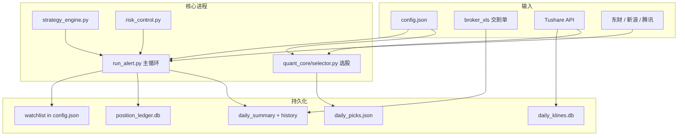

# stock-price-alert — Coding Plan 速览

> 给 Cursor Coding Plan / AI 编码助手用的**一页式地图**：先读本文，再按需下钻 `README.md`、`周常时间安排与命令.md`、`DeepSeek与豆包-系统与优化摘要.md`。

---

## 1. 这是什么（30 秒）

个人 A 股**量化监控 + 选股 + 风控 + 券商对账**工具，**不下单**。

| 能力 | 一句话 |
|------|--------|
| 盘中监控 | 轮询 `watchlist`，策略/风控/趋势/区间价 → 控制台 + macOS 通知 + 可选邮件/企微 |
| 盘前选股 | 全市场打分 + 回测 + ML 门槛 → `daily_picks.json` / `data/picks_history/` |
| 持仓台账 | `config.json` watchlist + `data/position_ledger.db` 流水，stdin 命令 `buy/add/sell/...` |
| 券商闭环 | 中信证券交割单 `broker_xls/*.xls` → 盈亏回灌 → 自动调参 |
| 数据 | Tushare Pro（日 K / 因子）+ 东财（现价/板块 BK）+ 本地 SQLite 缓存 |

**项目根目录**：`stock-price-alert/`（monorepo 子项目，独立 venv）。

---

## 2. 架构（数据流）



---

## 3. 真相来源（改东西前先确认）

| 数据 | 权威来源 | 说明 |
|------|----------|------|
| **当前持仓** | `config.json` → `watchlist`（`tags` 含「持仓」） | 截图对齐用 `scripts/fix_watchlist_weighted_hold.py` 或 stdin `hold` |
| **买卖流水** | `data/position_ledger.db` | `position_ledger.py`；与 watchlist 应一致 |
| **监控列表** | 同上 watchlist + `monitoring.watchlist_only` | 非仅持仓时还有选股写入的观察标的 |
| **盘前优质池** | `daily_picks.json` + `data/picks_history/YYYY-MM-DD.json` | 选股快照 |
| **日 K 缓存** | `data/daily_klines.db`（`kline_store.db_path`） | **选股前应先** `sync_daily_klines.py`，否则全市场选股极慢 |
| **券商盈亏** | `broker_xls/` + `daily_summary_history/` | 交割单驱动，非 watchlist 推导 |
| **运行时状态** | `.alert_state.json` | 冷却、抑制计数、当日是否已选股等 |

**不要提交**：`config.json` 内 token、`mail_config.json`、`.env`、`broker_xls/` 真实交割单。

---

## 4. 入口与命令

### 4.1 主入口

| 脚本 | 用途 |
|------|------|
| **`run_alert.py`** | 一切的核心：监控循环、stdin 持仓命令、盘前选股触发、`ops_automation` 定时任务 |
| `quant_cli.py` | 独立 CLI：`daily-select` / `backtest` |
| `sync_daily_klines.py` | 灌本地日 K（选股性能关键） |
| `broker_summary_sync.py` | 交割单批量回灌 |
| `broker_day_report.py` | 单日盈亏报告 |
| `routine_now.py` | 当前该做什么（运维提示） |

### 4.2 用户日常（见 `周常时间安排与命令.md`）

```bash
cd stock-price-alert
source .venv/bin/activate

# 日常：一条命令挂一天
python3 run_alert.py -c config.json --stdin-commands

# 选股前先同步 K 线（强烈建议）
python3 sync_daily_klines.py -c config.json

# 跳过启动选股、仅监控
python3 run_alert.py -c config.json --skip-daily-select --stdin-commands
```

### 4.3 stdin 持仓命令（在 run_alert 交互里）

```
showhold          # 查看持仓
hold 600711 8400 12.4061   # 覆盖/写入（注意 hold 对已有仓会加权合并）
buy / add / reduce / sell / unhold
```

对齐券商截图时，**绝对股数/成本**优先用：

```bash
python3 scripts/fix_watchlist_weighted_hold.py -c config.json --code 600711 --shares 8400 --cost 12.4061
```

---

## 5. 模块地图（改代码去这里）

| 路径 | 职责 |
|------|------|
| `run_alert.py` | 主循环、配置 merge、通知、hot sector、ops 自动化、stdin CLI |
| `quant_core/selector.py` | **盘前选股**：`load_df`、`get_real_score`、`run_daily_selector` |
| `quant_core/backtest.py` | 单票 1/3/5 年回测 |
| `quant_core/strategies.py` | 策略信号定义 |
| `quote_tushare.py` | Tushare Pro：日 K、rt_k、申万、因子；**限流 + 重试 + 多基址** |
| `quote_eastmoney.py` | 东财现价/K 线、`secid` 规则 `1.xxx`/`0.xxx` |
| `sector_em.py` | 东财行业板块 BK 解析与日 K |
| `strategy_engine.py` | 买卖策略文案与评分 |
| `risk_control.py` | 止盈止损、仓位、补仓 |
| `position_ledger.py` | SQLite 持仓流水 |
| `daily_summary.py` | 收盘摘要 JSON |
| `broker_summary_sync.py` | 交割单 → summary / 信号采纳 |
| `ml_forward4.py` | 4 日收涨概率模型（选股门槛） |
| `data_health.py` | HTTP 失败退避、`[DATA_OUTAGE]` |
| `config_schema.json` | 启动 JSON Schema 校验 |

---

## 6. 配置要点（`config.json`）

合并默认值在 `run_alert.merge_full_config()`；改 schema 时同步 `config.example.json` + `config_schema.json`。

| 键 | 含义 |
|----|------|
| `watchlist[]` | 监控 + 持仓（`hold_shares` / `cost_price` / `tags`） |
| `capital.total` | 账户总资产（风控仓位比例用） |
| `quant_selector.*` | 选股阈值、并发 `daily_select_max_workers`、SQLite `use_sqlite_cache` |
| `sources.tushare.*` | Token、`pro_dataapi_base`、`adj_factor_max_per_minute`（200/min 瓶颈） |
| `kline_store.*` | `data/daily_klines.db` |
| `ops_automation.*` | 15:10 收盘任务、交割单回灌、auto_tune |
| `monitoring.skip_startup_daily_select` | 启动时不跑选股 |
| `data_health.*` | 全失败检测与趋势抑制 |

---

## 7. 自动化时间线（`ops_automation.enabled: true`）

| 时机 | 动作 |
|------|------|
| 进程启动 | 近 3 日交割单回灌（`broker_sync_on_startup`） |
| 盘前 | 全市场选股 → `daily_picks.json`（可被 `--skip-daily-select` 跳过） |
| 15:10 | `daily_summary`、当日交割单、selector/auto_tune 链 |
| 周五收盘后 | 策略分调参、买入过滤 digest 等 |

---

## 8. 常见任务 → 改哪里

| 任务 | 位置 |
|------|------|
| 对齐券商持仓 | `config.json` watchlist；`scripts/fix_watchlist_weighted_hold.py` |
| 选股太慢 | 先跑 `sync_daily_klines.py`；降 `daily_select_max_workers`；查 Tushare 限流 |
| Tushare 报错「接收数据异常」 | `quote_tushare.py` 重试链；偶发可忽略；检查 VPN |
| 新增策略信号 | `strategy_engine.py` + `quant_core/strategies.py` |
| 通知文案 | `strategy_engine.py` / `notify_*.py` |
| 选股门槛 | `quant_selector` + `ml_forward4` 配置 |
| 券商报告 | `broker_day_report.py` / `broker_period_report.py` |
| 测试 | `tests/`；`python3 -m pytest tests/ -q` |

---

## 9. 已知坑（编码时别踩）

1. **选股 4904 只 + 无 K 线缓存** → 每只调 Tushare `pro_bar`，`adj_factor` **200 次/分钟**，进度每 200 只才打印，看起来像卡死。
2. **`hold` 对已持仓会加权合并**，不是覆盖；对齐截图用 `fix_watchlist_weighted_hold.py`。
3. **`run_alert` + 选股 + MCP 同时用同一 Tushare token** → 更容易限流/解压失败。
4. **板块柱**用东财 BK 指数 K，不是申万字符串匹配（申万主要用于选股板块强度）。
5. **`run_alert.py` 很大（~9k 行）** — 新逻辑优先抽到独立模块，少继续堆单体函数。
6. **配置变更** — 启动会 `jsonschema` 校验；类型错误直接退出。

---

## 10. 测试与质量

```bash
cd stock-price-alert
pip install -r requirements-dev.txt
python3 -m pytest tests/ -q
python3 -m pytest tests/test_tushare_dataapi_base.py -q   # Tushare 基址/重试
python3 scripts/smoke_data_sources.py                      # 数据源冒烟
```

---

## 11. 相关文档索引

| 文档 | 内容 |
|------|------|
| `README.md` | 开箱、配置项说明 |
| `周常时间安排与命令.md` | **用户运维**命令清单（人类操作） |
| `DeepSeek与豆包-系统与优化摘要.md` | 设计 + 性能优化摘要 |
| `docs/系统优化项进展.md` | 优化项落地状态 |
| `config.example.json` | 配置注释与默认值参考 |

---

## 12. 当前持仓示例（2026-06-03，随用户更新）

对齐后 watchlist 典型为 6 只：`600711` `600663` `600105` `002185` `001234` `603206`。  
**以 `config.json` 为准**，本节仅作 Coding Plan 上下文，勿硬编码在代码里。

---

*文档版本：2026-06-03 · 维护者：改架构/流程时同步更新本节与 §3 真相来源表。*
