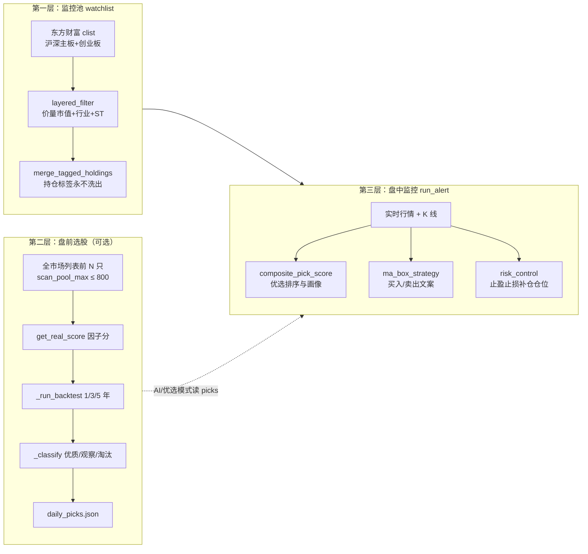

# 筛选与判断逻辑（总览）

本文说明本项目中 **谁先进池、谁被标成优质/观察、盘中如何排序、实时如何判买卖、风控如何提示** 的分工与顺序。数值公式与参数细节见同目录 **[评分与买卖信号说明.md](./评分与买卖信号说明.md)**。

---

## 整体数据流

要点：

1. **watchlist**（`config.json`）决定 **长期监控哪些代码**；由 `stock_scanner` 定期重筛写入，但 **带「持仓」类标签的条目不会被扫描结果洗掉**。
2. **daily_picks**（`daily_picks.json`）是 **盘前批量评分+回测** 的产物，用于「优质/观察池」展示或盘中收窄监控面（与主流程如何衔接以你当前 `run_alert` 启动参数为准）。
3. **同一只票在池子里** 后，盘中每条轮询会做：**优选画像排序**（可选卡片）、**均线箱体策略判买卖文案**、**持仓风控**；三者独立，数值不可混为一谈。

---

## 第一层：全市场分层筛选 → `watchlist`

**代码：** `stock_scanner.py`（`fetch_all_hs_cy_rows` → `layered_filter` → `merge_tagged_holdings` → 写回 `config.json`）

**目的：** 从东方财富全量列表里筛出 **流动性、市值、价格、板块、名称风险** 达标的标的，截断为 `scan_pool_max`（200～800）条写入监控池。

| 判断项 | 逻辑摘要 |
|--------|----------|
| **市场范围** | 沪深主板 + 创业板（`fs` 配置）；排除科创板 688/689、北交所常见段等（`_code_board_allowed`） |
| **名称风险** | 名称含 ST、*ST、PT、「退」等剔除（`_name_risk_ok`） |
| **价格** | 介于 `scan_rule.min_price`～`max_price`（默认约 5～32 元） |
| **流通市值** | 介于 `min_float_mv_yi`～`max_float_mv_yi`（默认约 28～750 亿） |
| **成交额** | 当日成交额 ≥ `min_daily_amount_wan`（默认约 6500 万） |
| **停牌** | 涨幅与成交额同时为 0 级异常则剔除 |
| **行业** | 黑名单（地产、钢铁、银行等）剔除；白名单命中或「中性拓展」行业才入池（`_industry_allowed`） |
| **持仓保留** | `merge_tagged_holdings`：上一版 watchlist 里 **带持仓标签** 的代码 **始终保留**；其余代码以本轮扫描结果为准重建 |

**扫描频率：** `scan_meta.last_full_scan_iso` 与 `scan_rule.full_scan_interval_days`（默认约 3 天）；不足间隔则跳过，除非 `--force-scan`。

---

## 第二层：盘前批量 → 优质 / 观察 / 淘汰

**代码：** `quant_core/selector.py`（`run_daily_selector`）

**目的：** 对 **全市场列表排序后的前 `max_scan` 只**（受 `scan_pool_max` 与上限 800 约束）逐只拉 K 线，算 **因子分** + **简化回测**，再 `_classify` 分桶，写入 `daily_picks.json`。

| 判断项 | 逻辑摘要 |
|--------|----------|
| **数据** | `load_df`：优先 Baostock，失败则 akshare；不足约 30 根 K 则因子分默认约 3、回测弱 |
| **因子分** | `get_real_score`：趋势（收盘 vs MA20/MA60）、箱体位置、波动率、量比等加权，约 0～10 |
| **回测** | `_run_backtest_on_df`：MA20 上穿 MA60 当买入参考，之后 20 日内 +8% / -4% 止盈止损否则平仓；得到 1 年/3 年/5 年累计收益与胜率 |
| **分桶** | **优质股**：因子≥5.5 且 1 年 profit≥0、胜率≥50%、3 年 profit≥-8 等；**观察股**条件略宽；其余 **淘汰股**（见 `_classify` 与说明文档表格） |
| **输出截断** | 优质、观察各取 `top_n_per_strategy` 排序头部（代码内默认上限与 `run_daily_selector` 参数一致） |

---

## 第三层（盘中）：优选画像排序 —— 谁排在「低吸优选」前面

**代码：** `pick_score.py`（`composite_pick_score`）

**目的：** 在 **当前监控列表** 内，用形态、历史胜率估计、流动性、投机惩罚、宏观乘数等算 **`sort_score`**，用于展示 **【优选画像】** 与排序；**不参与**「是否该买」的最终下单判断。

| 模块 | 作用 |
|------|------|
| `pattern_score` | MA5>MA20、箱体偏下、策略文案含「低吸」等加分；含「减仓」扣分 |
| `estimate_win_rate_pct` | 历史 K 上简化信号的后验胜率估计 |
| `liquidity_score` | 成交额、流通市值相对 `scan_rule` 给分 |
| `speculative_penalty` | 过小盘、过短暴涨等乘数惩罚 |
| `macro_mult` | 来自宏观情绪模块，整体缩放总分 |
| `risk_level_label` / `dip_logic_text` | 风险档与说明文案 |

与 `get_real_score` 的区别：**一个管盘前分桶，一个管盘中列表内排序**，见 [评分与买卖信号说明.md](./评分与买卖信号说明.md) 第二节。

---

## 第三层（盘中）：买卖文案 —— 【买入信号】/【卖出信号】

**代码：** `quant_core/strategies.py`（`evaluate_all_strategies`）→ `strategy_engine.py`（`ma_box_strategy`）

**目的：** 基于 **当前价** 与 **当日 K 线派生字段**（MA5/MA20、20 日高低等），三条子策略可能同时满足，**只取 `score` 最高的一条**，拼成一行中文（含 `【买入信号】` 或 `【卖出信号】`）。

| 子策略 | 典型触发 | 归为买入或卖出 |
|--------|-----------|----------------|
| `ma_dip` | 均线多头且价在箱体下半等 → `buy_watch`；弱势跌破 → `risk_reduce` | 买 / 卖 |
| `box_breakout` | 突破 20 日高 / 跌破 20 日低 | 买 / 卖 |
| `range_arbitrage` | 区间下 20% / 上 20% | 买 / 卖 |

映射规则：**买入类** `buy_watch`、`buy_breakout`、`buy_range_low` → 文案含 **【买入信号】**；**卖出类** `risk_reduce`、`stop_loss_alert`、`sell_range_high` → **【卖出信号】**。  

这是 **技术位提示**，不是自动下单。

---

## 第三层（盘中）：持仓风控判断

**代码：** `risk_control.py`（止盈止损、补仓、仓位）；`quant_core/risk.py`（仓位建议、高位警戒等，若主流程有接入）

**前提：** 监控规则里配置了 **`cost_price`（成本）** 等，止盈止损与补仓档位才按文档中的比例触发；详见 [评分与买卖信号说明.md](./评分与买卖信号说明.md) 第四节。

---

## 通知与邮件（与「筛选」的关系）

- **系统通知**：策略信号、风控等通道满足 **冷却时间** 且未使用 `--no-notify` 时推送。
- **邮件**：`email_notify.py` 读取 **`mail_config.json`**；**买入信号** 邮件在出现买入类策略且配置有效时发送；**卖出信号** 邮件仅在 **`hold_shares > 0`**（config 中记了股数的持仓）时发送。

---

## 相关文件速查

| 层级 | 文件 |
|------|------|
| watchlist 扫描与合并 | `stock_scanner.py`、`position_tags.py` |
| 盘前因子+回测+分桶 | `quant_core/selector.py` |
| 盘中优选排序 | `pick_score.py` |
| 买卖文案 | `quant_core/strategies.py`、`strategy_engine.py` |
| 止盈止损补仓 | `risk_control.py` |
| 邮件 | `email_notify.py`、`mail_config.json`（本地，勿提交） |

更细的公式与默认阈值仍以 **[评分与买卖信号说明.md](./评分与买卖信号说明.md)** 与仓库代码为准。
